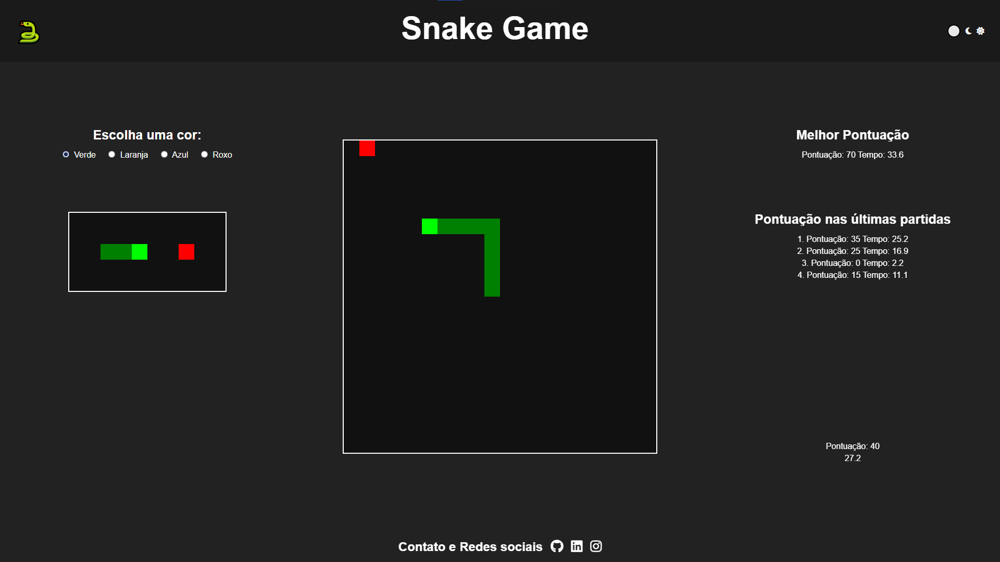
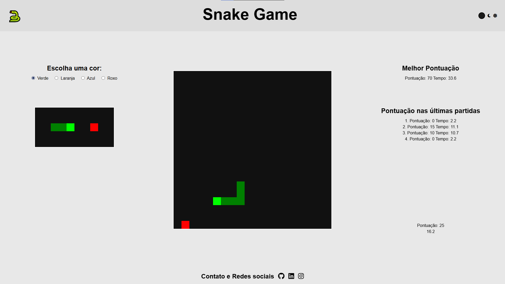

# 🐍 Snake Game - JavaScript Vanilla

Um jogo clássico da cobrinha desenvolvido do zero usando **HTML**, **CSS** e **JavaScript**.  
Este projeto foi criado com o objetivo de reforçar meus conhecimentos em lógica de programação, manipulação do DOM, eventos de teclado, uso do canvas 2D e deploy de aplicações web.

## 🚀 Demonstração

🔗 [Acesse o jogo online aqui](https://snake-game-one-sandy.vercel.app/)  

  

---

## 🎮 Funcionalidades

✅ Controle da cobrinha com teclas direcional (setas ou WASD)  

✅ Pontuação dinâmica exibida na tela  

✅ Velocidade progressiva a cada alimento consumido  

✅ Modo Escuro / Claro (Dark Mode)  

✅ Skins customizáveis para a cobrinha  

✅ Sons de ação (comer e perder)  

✅ Deploy online com Vercel

---

## 🛠️ Tecnologias utilizadas

- **HTML5** — Estrutura do jogo
- **CSS3** — Estilização, responsividade e temas
- **JavaScript (Vanilla)** — Lógica de jogo, manipulação do canvas, controle de eventos
- **Vercel** — Deploy e hospedagem

---

## 📌 Aprendizados

Neste projeto, pratiquei e aprofundei:

- Utilização de `localStorage` para armazenar pontuações
- Desenho com **Canvas 2D**
- Controle de fluxo de jogo com `setInterval` e `clearInterval`
- Lógica de **colisão** e **Game Over**
- Implementação de **dificuldade progressiva**
- Integração de **áudio** no navegador
- Criação de **modo escuro** e **skins**
- Deploy profissional com **Vercel**

---

## 🚧 Melhorias Futuras

- [ ] Responsividade mobile
- [ ] Escolher tamanho de mapa
- [ ] Novos modos de jogo
- [ ] Consquistas

---

## 👨‍💻 Autor

Desenvolvido por **Ériton Longui**

📫 [LinkedIn](https://www.linkedin.com/in/eritonLongui/)

---

## 📝 Licença

Sinta-se à vontade para usar, estudar e modificar.

---